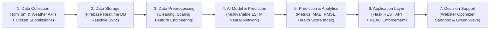
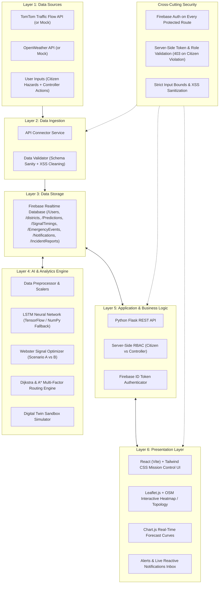

# 🚦 TrafficTwin AI — Intelligent Digital Twin for Tamil Nadu Smart Cities

An AI-Powered Digital Twin for Intelligent Traffic Prediction, Signal Optimization, Emergency Priority Dispatching, and Dynamic Route Guidance across all **38 Tamil Nadu Districts**.

---

## 📋 1. Project Workflow (7 Stages)



| Stage | Title | Description |
|---|---|---|
| **Stage 1** | **Data Collection** | Ingestion of real-time flow and weather feeds (TomTom & OpenWeather APIs) with clean mock fallbacks, plus citizen incident reports and controller signal overrides. |
| **Stage 2** | **Data Storage** | Firebase Realtime Database as the single real-time data store connecting all live frontend listeners (`onValue`) for reactive state sync. |
| **Stage 3** | **Data Preprocessing** | Min-Max scaling, outlier filtering, diurnal peak cycle extraction, rain delay indexing, and multi-lag sliding sequence windows. |
| **Stage 4** | **AI Model & Prediction** | Multi-variable Long Short-Term Memory (LSTM) Neural Network forecasting 15, 30, 45, and 60 minutes ahead for vehicle count, congestion %, speed, queue, and travel time. |
| **Stage 5** | **Prediction & Analytics** | Statistical evaluation (MAE, RMSE, MAPE, $R^2$), Composite Traffic Health Score (0–100), and chronic bottleneck detection. |
| **Stage 6** | **Application Layer** | Python Flask REST API backend + Role-Based Access Control (`citizen` vs `controller`) and Firebase Auth token verification. |
| **Stage 7** | **Decision Support** | Webster's minimum delay signal optimization, Digital Twin What-If Sandbox simulation, and Emergency Vehicle Priority dispatch with live stuck alerts. |

---

## 🏛️ 2. System Architecture (6 Layers + Cross-Cutting Security)



---

## ⚡ 3. Quick Start (1-Command Offline Local Run)

### Prerequisites
- **Python 3.10+**
- **Node.js 18+** & **npm**

### Installation & Launch
```bash
# 1. Install dependencies
pip install -r requirements.txt
cd frontend && npm install && cd ..

# 2. Start the entire application with one command
python run_app.py
```
*(On Windows, you can simply double-click `start.bat`)*

### Access Endpoints
- 🖥️ **Frontend Mission Control**: [http://localhost:5173](http://localhost:5173)
- ⚡ **Backend Flask API**: [http://localhost:5000/api/health](http://localhost:5000/api/health)

---

## 🔑 4. Demo Evaluation Credentials

| Role | Email | Password | Access Level |
|---|---|---|---|
| **Citizen** | `citizen@demo.com` | `demo1234` | Live Map, Route Recommender (Dijkstra + A*), Report Incidents, My Alerts |
| **Traffic Controller** | `controller@demo.com` | `demo1234` | Full Access: Signal Optimization, What-If Simulator, Emergency Priority, LSTM Prediction Lab, Decision Center, Historical Analytics |

*(1-Click instant login buttons are also provided directly on the login screen for rapid evaluator access)*

---

## 🔄 5. Switching from Local Emulator to Real Firebase Production

1. Create a Firebase project in the [Firebase Console](https://console.firebase.google.com/).
2. Enable **Authentication** (Email/Password) and **Realtime Database**.
3. Generate a service account key JSON and place it at `backend/serviceAccountKey.json`.
4. In `.env`, switch:
   ```env
   FIREBASE_ENV=production
   FIREBASE_PROJECT_ID=your-firebase-project-id
   FIREBASE_DATABASE_URL=https://your-firebase-project-default-rtdb.firebaseio.com
   FIREBASE_SERVICE_ACCOUNT_PATH=backend/serviceAccountKey.json
   ```
5. In `frontend/.env` (or environment), update:
   ```env
   VITE_USE_EMULATOR=false
   VITE_FIREBASE_PROJECT_ID=your-firebase-project-id
   VITE_FIREBASE_DATABASE_URL=https://your-firebase-project-default-rtdb.firebaseio.com
   VITE_FIREBASE_API_KEY=your-actual-web-api-key
   ```

---

## 📐 6. Project Report Academic Appendix (Mathematical Formulations)

### A. Long Short-Term Memory (LSTM) Performance Metrics
1. **Mean Absolute Error (MAE)**:
   $$\text{MAE} = \frac{1}{n} \sum_{i=1}^{n} |y_i - \hat{y}_i|$$
2. **Root Mean Square Error (RMSE)**:
   $$\text{RMSE} = \sqrt{\frac{1}{n} \sum_{i=1}^{n} (y_i - \hat{y}_i)^2}$$
3. **Mean Absolute Percentage Error (MAPE)**:
   $$\text{MAPE} = \frac{100\%}{n} \sum_{i=1}^{n} \left| \frac{y_i - \hat{y}_i}{y_i} \right|$$
4. **Coefficient of Determination ($R^2$ Score)**:
   $$R^2 = 1 - \frac{\sum_{i=1}^{n} (y_i - \hat{y}_i)^2}{\sum_{i=1}^{n} (y_i - \bar{y})^2}$$

### B. Webster's Optimum Signal Timing Formulation
- **Optimum Cycle Length ($C_0$)**:
  $$C_0 = \frac{1.5L + 5}{1 - Y}$$
  where $L$ is total lost time per cycle (seconds), $Y = \sum y_i$ is the sum of critical flow ratios $y_i = \frac{q_i}{S_i}$, with approach volume $q_i$ and saturation flow $S_i = 1800 \text{ veh/hr/lane}$.
- **Effective Green Allocation per Phase ($g_i$)**:
  $$g_i = \frac{y_i}{Y} \times (C_0 - L)$$

### C. Multi-Factor Route Optimization Cost Equation
$$\text{Score}(R) = w_1 \cdot \text{Congestion} + w_2 \cdot \text{TravelTime} + w_3 \cdot \text{Distance} + w_4 \cdot \text{Weather} + w_5 \cdot \text{Incidents}$$
with default weights $\sum w_i = 1.0$.

### D. Emergency Priority Corridor Improvement Percentage
$$\text{Improvement}\% = \frac{T_{\text{normal}} - T_{\text{priority}}}{T_{\text{normal}}} \times 100\%$$
